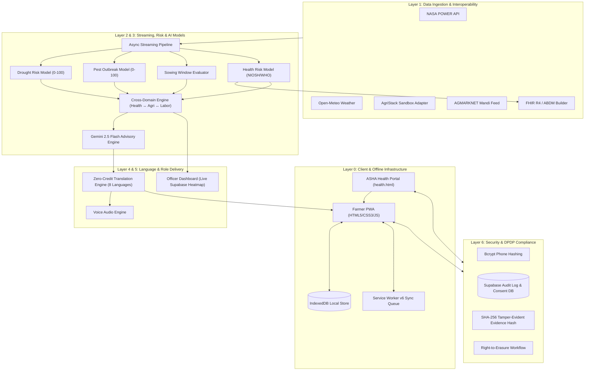
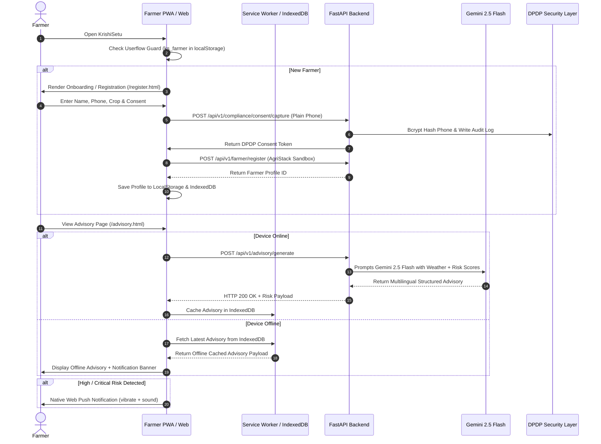

# 🌾 KrishiSetu (कृषि सेतु)
> **AI-Powered Offline-First Agritech & Rural Healthcare Platform for Farmers and ASHA Workers**  
> *IIT Guwahati Hackathon — Production Prototype Submission (v3.0.0)*

---

## 🌟 Executive Summary

**KrishiSetu** bridges the digital divide for smallholder farmers and primary healthcare workers across rural India. Operating seamlessly on 2G/3G networks and offline, KrishiSetu delivers hyper-local crop risk advisories, heat-stress labor scheduling, occupational health risk triage (ASHA portal), ABDM/FHIR R4-compliant health observations, live market prices, and DPDP-compliant data governance.

### ⭐ Key Technical Differentiators
1. **Integrated Healthcare ↔ Agritech Bridge**:
   - *Occupational Health Scoring*: Rule-based clinical model evaluating heat exposure + pesticide hours + reported symptoms (Deterministic: 38.5°C + 75% RH + 6h pesticide + 3 symptoms = **64/100 HIGH Risk**, capping labor at 4h/day).
   - *ABDM-Ready FHIR R4 Interoperability*: Exports conformant FHIR R4 Observation bundles with standard clinical LOINC codes (`60830-9` ambient temp in °C, `56848-4` chemical exposure in h/wk, `75325-1` symptom severity assessment score).
   - *Cross-Domain Action*: High/Critical health risks recorded by ASHA workers automatically curtail daily farm labor hours in the farmer's agricultural advisory.
2. **Production Benchmarks & 2G Budget**: Full first load bundle is only **35.40 KB gzipped** (5.66s on 2G, 0.19s on 3G, <50ms repeat offline via Service Worker v6). Full report in [`performance_benchmarks.md`](./performance_benchmarks.md).
3. **Offline-First PWA & Web Push (Layer 0)**: Core farmer workflows operate offline using IndexedDB local storage, Service Worker v6 background sync, and native Web Push notifications via VAPID.
4. **AgriStack Sandbox Integration**: Plug-and-play adapter tested with local mock sandbox, ready to point to live AgriStack sandbox endpoint.
5. **Supabase PostgreSQL & DPDP / Health Security**: Real cloud database with zero plain-text PII storage; phone numbers bcrypt-hashed, health data encrypted via AES-256 with immediate purge upon DPDP right-to-erasure request, and SHA-256 tamper-evident insurance evidence logging.
6. **Role-Based Delivery**:
   - *Farmer Mobile PWA*: Multilingual crop advisory, audio voice playback, offline sync.
   - *ASHA Health Worker Portal (`/health.html`)*: Fast symptom triage & ABDM-ready FHIR R4 inspection.
   - *Agri-Extension Officer Dashboard (`/`)*: Live village risk heatmap aggregated directly from Supabase PostgreSQL.

---

## 📐 System Architecture



---

## 🔄 Userflow & Data Processing Flow



---

## 🧱 The 7-Layer Stack Breakdown

| Layer | Component | Implementation Highlights |
|:---:|:---|:---|
| **0** | **Offline Client** | `sw.js` (Network-First v6), `db.js` (IndexedDB), Native Web Push Notifications API |
| **1** | **Data Ingestion** | `ingestion/weather.py` (NASA POWER daily + Open-Meteo), `mandi_feed.py` (AGMARKNET data.gov.in), `health/fhir_builder.py` |
| **2** | **Streaming Engine** | `stream/stream.py` (Async event pipeline emitting village-level risk signals) |
| **3** | **Risk & AI Models** | `models/drought.py`, `models/pest.py`, `models/sowing.py`, `models/cross_domain.py`, `health/health_risk_model.py`, `advisory/gemini_advisor.py` |
| **4** | **Language & Voice** | `language/translate.py` (Zero-credit translation for 8 Indian languages) + Voice Audio Engine |
| **5** | **Role Delivery** | Multi-page PWA for Farmers (`/home.html`, `/advisory.html`, `/market.html`, `/profile.html`) + ASHA Portal (`/health.html`) + Officer Dashboard (`/dashboard.html`) |
| **6** | **DPDP Security** | `api/routes/compliance.py` (bcrypt phone hashing, Supabase audit logging, 30-day erasure, RBAC enforcement) |

---

## 📁 Repository Structure

```
krishisetu/
├── main.py                        # FastAPI entry point & router mounting
├── requirements.txt               # Python dependencies (fastapi, uvicorn, pydantic, bcrypt)
├── .env.example                   # Environment variable template
├── README.md                      # Complete technical documentation
│
├── api/routes/
│   ├── advisory.py                # AI advisory pipeline & TTS endpoint
│   ├── compliance.py              # DPDP consent capture & erasure requests
│   ├── cross_domain.py            # Labor advisory & insurance event logging
│   ├── farmer.py                  # AgriStack farmer registration router
│   ├── ingestion.py               # Weather & satellite data routes
│   ├── mock_agristack.py          # Mock AgriStack sandbox backend
│   └── prices.py                  # AGMARKNET mandi price feed
│
├── advisory/
│   └── gemini_advisor.py          # Gemini 2.5 Flash prompt engine + MD5 caching
│
├── ingestion/
│   ├── agristack_adapter.py       # AgriStack integration client
│   ├── mandi_feed.py              # AGMARKNET open API integration
│   └── weather.py                 # NASA POWER + Open-Meteo weather client
│
├── language/
│   └── translate.py               # Multilingual translation bank & ElevenLabs TTS
│
├── models/
│   ├── cross_domain.py            # Cross-domain logic (Heat->Labor, Pest->Insurance)
│   ├── drought.py                 # Cumulative precipitation & temperature drought model
│   ├── pest.py                    # Relative humidity & temperature pest outbreak model
│   └── sowing.py                  # Monsoon onset & soil moisture sowing evaluator
│
├── stream/
│   └── stream.py                  # Async streaming event emitter
│
└── frontend/
    ├── index.html                 # Landing & Onboarding page
    ├── home.html                  # Farmer home dashboard page
    ├── advisory.html              # Dedicated AI Advisory page
    ├── market.html                # Dedicated Mandi Prices page
    ├── register.html              # Dedicated Farmer Registration page
    ├── profile.html               # Dedicated Profile & Insurance Log page
    ├── dashboard.html             # Agri-Extension Officer Dashboard (Leaflet + Chart.js)
    ├── manifest.json              # PWA manifest
    ├── sw.js                      # Service Worker v6 (Network-first + offline cache + push)
    ├── health.html                # ASHA Health Worker Portal (FHIR R4 Inspection)
    ├── css/
    │   └── app.css                # Shared warm design system (Linen, Forest Green, Amber)
    └── js/
        ├── shared.js              # Shared userflow guards, push alerts, API client
        ├── home.js                # Home page UI logic
        ├── advisory.js            # Advisory page UI logic
        ├── market.js              # Market prices UI logic
        ├── register.js            # Registration form UI logic
        ├── profile.js             # Profile & insurance log UI logic
        ├── dashboard.js           # Officer dashboard UI logic (Leaflet + Chart.js)
        └── db.js                  # IndexedDB client manager
```

---

## ⚡ Quick Start & Installation

### Prerequisites
- **Python 3.10+** (Python 3.13 supported via prebuilt wheels in `requirements.txt`)
- **pip** package manager

### 1. Installation
```bash
# Clone repository
git clone https://github.com/your-username/krishisetu.git
cd krishisetu

# Create virtual environment (optional but recommended)
python -m venv venv
# On Windows: venv\Scripts\activate
# On Linux/macOS: source venv/bin/activate

# Install dependencies (CRITICAL: install all dependencies before running tests or server)
pip install -r requirements.txt
```

### 2. Configuration
Copy `.env.example` to `.env` and add your **Gemini API Key**:
```bash
cp .env.example .env
```
Edit `.env`:
```env
GEMINI_API_KEY=AIzaSy...your_gemini_api_key_here
```

### 3. Database Setup (Supabase PostgreSQL)
Execute `schema.sql` in your Supabase SQL Editor to create all 6 production tables (`farmers`, `health_observations`, `consent_records`, `insurance_events`, `push_subscriptions`, `audit_log`).

### 4. Running the Server
```bash
python -m uvicorn main:app --host 0.0.0.0 --port 8000 --reload
```

Open in your browser:
- 📊 **Public Officer Dashboard (Root Entry)**: [http://localhost:8000/](http://localhost:8000/) or [http://localhost:8000/dashboard.html](http://localhost:8000/dashboard.html)
- 🏥 **ASHA Health Worker Portal (FHIR R4)**: [http://localhost:8000/health.html](http://localhost:8000/health.html)
- 🌾 **Farmer App Onboarding / Landing**: [http://localhost:8000/landing.html](http://localhost:8000/landing.html)
- 🔑 **Farmer Sign In (Supabase Auth)**: [http://localhost:8000/login.html](http://localhost:8000/login.html)
- 🏠 **Farmer Home Dashboard**: [http://localhost:8000/home.html](http://localhost:8000/home.html)
- 📑 **Swagger API Documentation**: [http://localhost:8000/docs](http://localhost:8000/docs)
- 🤖 **AI Advisory**: [http://localhost:8000/advisory.html](http://localhost:8000/advisory.html)
- 💰 **Mandi Prices**: [http://localhost:8000/market.html](http://localhost:8000/market.html)
- 👤 **Profile & Insurance**: [http://localhost:8000/profile.html](http://localhost:8000/profile.html)
- 📖 **API Docs (Swagger)**: [http://localhost:8000/docs](http://localhost:8000/docs)

---

## 🔌 API Endpoint Reference

| Method | Endpoint | Description |
|:---:|:---|:---|
| `POST` | `/api/v1/advisory/generate` | Executes 3 risk models & invokes Gemini 2.5 Flash for structured advisory |
| `POST` | `/api/v1/advisory/tts` | Converts advisory text into MP3 voice stream (ElevenLabs) |
| `GET`  | `/api/v1/data/weather` | Fetches NASA POWER / Open-Meteo weather parameters |
| `GET`  | `/api/v1/prices/mandi` | Fetches live mandi prices from AGMARKNET API |
| `POST` | `/api/v1/farmer/register` | Registers farmer with AgriStack Sandbox |
| `POST` | `/api/v1/cross-domain/labor-advisory` | Computes heat stress & safe field working hours |
| `POST` | `/api/v1/cross-domain/insurance-log` | Creates tamper-evident log entry for crop insurance claims |
| `GET`  | `/api/v1/cross-domain/insurance-trail/{farmer_id}` | Retrieves insurance evidence trail |
| `POST` | `/api/v1/compliance/consent/capture` | Hashes phone with bcrypt & logs DPDP consent |
| `POST` | `/api/v1/compliance/erasure/request` | Registers 30-day DPDP right-to-erasure request |

---

## 🎯 Presentation & Live Demo Guide

For hackathon judges, follow this 4-step demonstration flow:

1. **Onboarding & DPDP Security**:
   - Open `http://localhost:8000/` → Click **Get Started** → Register a new farmer.
   - Show that phone number is hashed on backend (`bcrypt`) and DPDP consent is recorded.
2. **AI Advisory & Voice**:
   - View `http://localhost:8000/advisory.html` → Explain the 3 risk scores (Drought, Pest, Sowing).
   - Switch language (e.g. Hindi/Assamese) → Click **Listen** for voice playback.
3. **Cross-Domain Intelligence**:
   - Point out the **Field Work Safety** card (Heat Stress → Labor Scheduling).
   - Click **Log Evidence** → Open `http://localhost:8000/profile.html` to view the saved insurance trail.
4. **Macro-Level Extension Dashboard & Offline Test**:
   - Open `http://localhost:8000/dashboard.html` → Show the Leaflet village risk heatmap & Chart.js price trends.
   - Go offline (F12 → Network → Offline) → Refresh farmer pages to show smooth IndexedDB offline playback.

---

## 📜 License
Developed for the **IIT Guwahati Hackathon 2026 — Agritech Track**. Open source under the MIT License.
